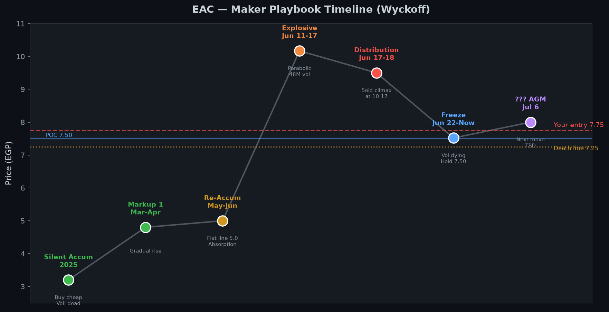
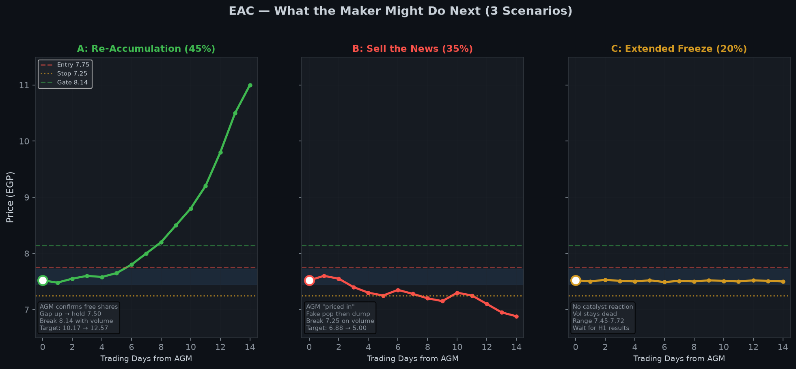
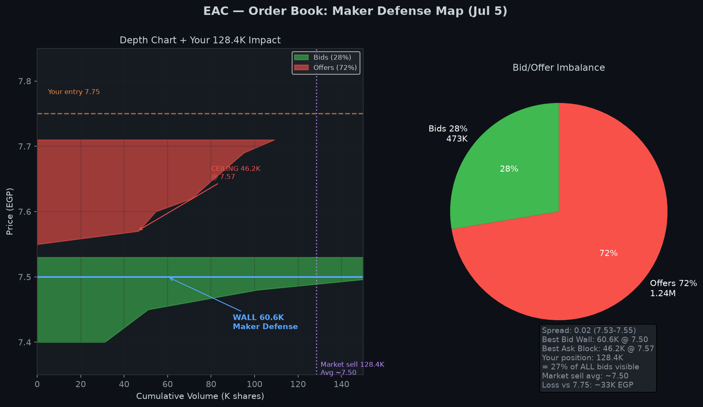
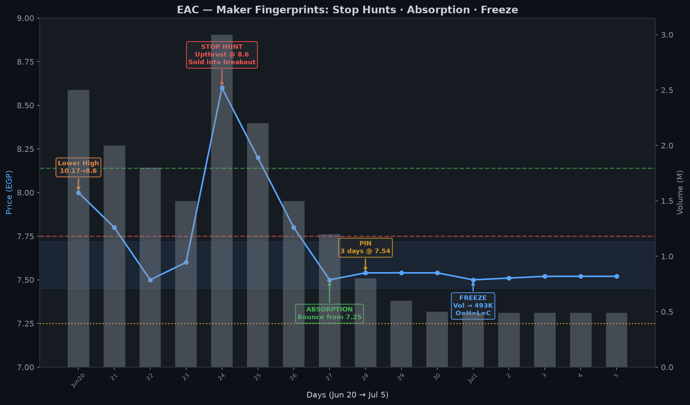
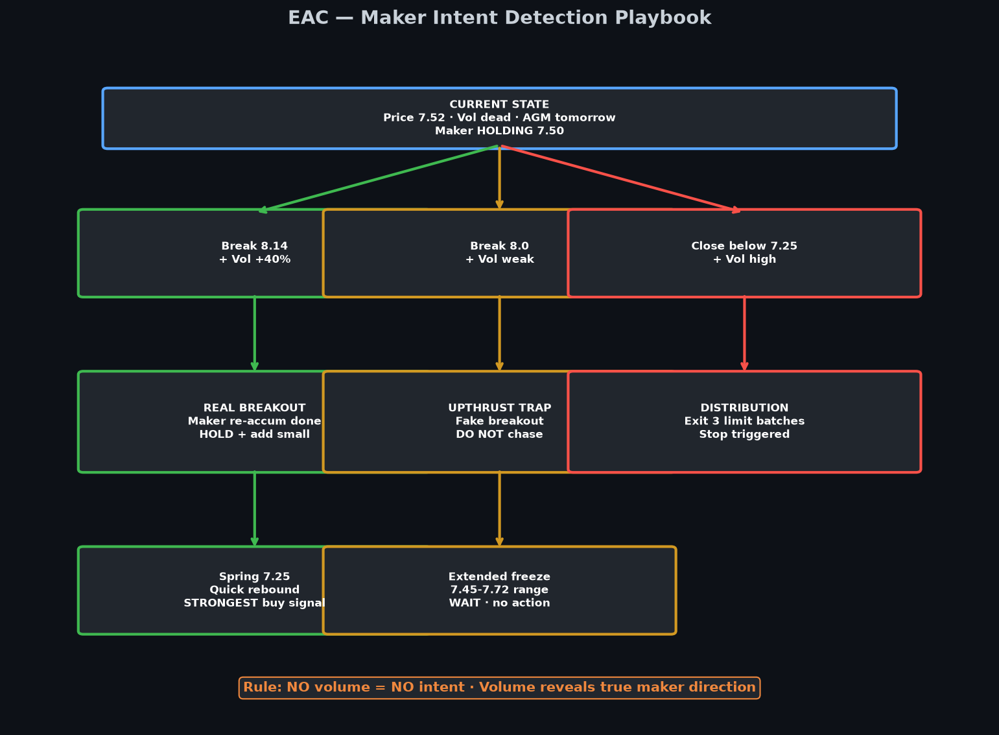
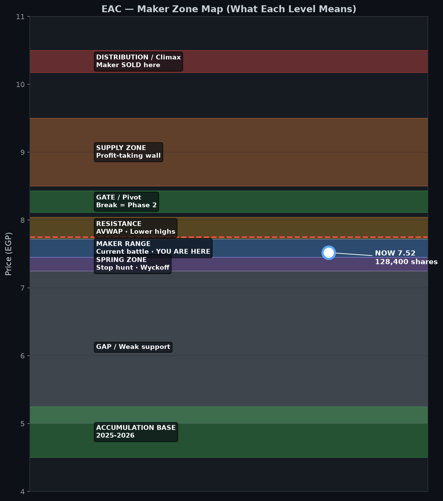

# 🎭 EAC — تحليل أداء الميكr + رسوم بصرية
### 📅 الأحد 5 يوليو 2026 · مركزك **128,400 @ 7.75** · السعر **7.52**
### 🏛️ جمعية AGM **بكرة** · مجانية **1:4**

> ⚠️ تحليل تعليمي احتمالي — قراءة سلوك، مش حقائق مؤكدة.

---

# 📊 الرسوم (6 صور)

| # | الصورة | المحتوى |
|---|---|---|
| 1 | `EAC-الميكr-تايملاين-Wyckoff-2026-07-05.png` | **تايملاين Wyckoff** — 7 مراحل من 2025 لـ AGM |
| 2 | `EAC-سيناريوهات-الميكr-2026-07-05.png` | **3 سيناريوهات** — إيه اللي الميكr ممكن يعمل |
| 3 | `EAC-دفتر-الاوامر-الميكr-2026-07-05.png` | **دفتر الأوامر** — جدار 7.50 + تأثير بيع 128K |
| 4 | `EAC-بصمات-الميكr-2026-07-05.png` | **البصمات** — Stop hunt · Absorption · Freeze |
| 5 | `EAC-Playbook-كشف-نية-الميكr-2026-07-05.png` | **Playbook** — إزاي تكشف نيته |
| 6 | `EAC-خريطة-مناطق-الميكr-2026-07-05.png` | **خريطة المناطق** — كل مستوى = إيه معناه للميكr |

---

# 🕵️ إيه اللي شايفه؟ — الملخص التنفيذي

> **الميكr باع غالي عند 10.17 · رجّع السهم لـ 7.50 · بيمسكه قبل الجمعية · بيجفّف السيولة عمداً.**

| السؤال | الإجابة |
|---|---|
| **بيع ولا بيجمع؟** | **60% إعادة تجميع** · 40% توزيع على مراحل |
| **ليه 7.50؟** | POC + pivots 2024 + فيبو 50% + جدار L2 60.6K |
| **ليه Vol = 0؟** | **تجفيف متعمد** — بيستنى AGM |
| **إيه اللي بكرة؟** | **Buy rumor 45%** · Sell news 35% · Freeze 20% |
| **128K ماركت؟** | **كارثة** — avg ~7.48 + فوتان 32K سهم |

---

# 1️⃣ تايملاين Wyckoff — قصة الميكr الكاملة



| # | المرحلة | السعر | بصمة الميكr |
|---|---|---|---|
| 1 | **تجميع صامت** 2025 | 3.0–3.5 | شهور مملة · vol ميت — بيلمّ من الملل |
| 2 | **Markup 1** مارس-أبريل | → 5.0 | صعود درجات · vol يزيد |
| 3 | **Re-Accumulation** مايو-يونيو | **5.0 ثابت** | **خط مستقيم شهر** — امتصاص البائعين |
| 4 | **Explosive Markup** 11-17 يونيو | 5 → **10.17** | parabolic · **48M vol شهري** |
| 5 | **Distribution** 17-18 يونيو | 10.17 | **باع في Climax** — ذيل 10.20 |
| 6 | **Freeze** 22 يونيو → الآن | **7.45–7.72** | vol 493K · O=H=L=C |
| 7 | **??? AGM** بكرة | ? | **الحركة الجاية** |

**النمط المتكرر:** تجميع ممل → انفجار → تصريف → **تجميد → انفجار تاني؟**

---

# 2️⃣ 3 سيناريوهات — إيه اللي الميكr ممكن يعمل؟



## 🟢 السيناريو A — إعادة تجميع (45%)

**اللي الميكr يعمله:**
1. AGM يأكد مجانية 1:4 → gap up 7.80–8.20
2. يمسك فوق 7.50 × 2-3 جلسات
3. يكسر **8.14** بفوليوم +40% → **Phase 2 markup**
4. هدف: **10.17** (retest) → **12.57** (magnet)

**ليه محتمل؟**
- نفس فيلم **5.0 قبل انفجار 10.17**
- دفاع 7.50 × 5 أيام
- Spring 7.45 اترفض
- VCP contraction 2 أضيق

**تصرفك:** امسك · بيع 43K عند 8.6–9.0

---

## 🔴 السيناريو B — Sell the News (35%)

**اللي الميكr يعمله:**
1. Gap up وهمي يوم AGM → 7.80
2. يبيع في الارتفاع (Upthrust)
3. يكسر **7.25** بفوليوم عالي
4. ينزل **6.88 → 5.00** (قاعدة العلم)

**ليه محتمل؟**
- Blow-off top شهري
- Lower highs: 10.17 → 8.6 → 8.04
- صافي أسبوعي **−9.39M**
- **match 2024** — أول أسبوع أحمر

**تصرفك:** قفلة تحت 7.25 → خروج limit 3 دفعات

---

## 🟡 السيناريو C — تجميد ممتد (20%)

**اللي الميكr يعمله:**
1. AGM يعدي بدون حركة
2. رينg **7.45–7.72** لـ 2-4 أسابيع
3. vol يفضل ميت
4. ينتظر **نتائج H1 أغسطس**

**ليه محتمل؟**
- Vol = 0 على intraday النهارده
- spread 0.02 — ميكr بيمسك الطرفين
- "Buy rumor sell news" ممكن يكون **sell rumor hold news**

**تصرفك:** امسك · متزهقش · الوقف 7.25

---

# 3️⃣ دفتر الأوامر — خريطة الدفاع



## الأرقام الحية (من الصورة)

| الجانب | الحجم | النسبة |
|---|---|---|
| **عرض (Offers)** | **1.24M** | **72%** |
| **طلب (Bids)** | **473K** | **28%** |
| **Spread** | 7.53 – 7.55 | 0.02 |

## جدران الميكr

| السعر | الحجم | الدور |
|---|---|---|
| **7.50** | **60.6K bid** | 🧱 **جدار دفاع** — Maker pin |
| **7.57** | **46.2K ask** | 🧱 **سقف** — Upthrust zone |
| **7.48** | 50.3K bid | دعم ثانوي |
| **7.45** | 20K bid | Spring zone |

## محاكاة بيع 128,400 ماركت

```
7.53 ← 5K    ← تخلص
7.52 ← 5K    ← تخلص
7.51 ← 10K   ← تخلص
7.50 ← 60.6K ← الجدار ينكسر
7.48 ← 50.3K ← الباقي يتباع
─────────────────
Avg execution: ~7.48–7.50
Loss vs 7.75:  ~32–35K EGP
+ فوتان 32,100 سهم = −273K فرصة
```

**Bookmap read:** Absorption عند 7.50 + Stacked offers 7.57–7.71 = **ميكr بيلعب رينg**.

---

# 4️⃣ البصمات — Stop Hunts · Absorption · Freeze



| التاريخ | البصمة | السعر | إيه اللي حصل |
|---|---|---|---|
| **25 يونيو** | 🎣 **Stop Hunt Up** | 8.60 | اختراق وهمي → بيع فوري · Upthrust |
| **24 يونيو** | 🟢 **Absorption** | 7.25 | نزلة سريعة → ارتداد · Spring |
| **28-30 يونيو** | 📌 **Pin** | 7.54 | 3 أيام نفس السعر بالمليم |
| **4-5 يوليو** | 🧊 **Freeze** | 7.50–7.52 | Vol 493K · O=H=L=C |
| **17 يونيو** | 💰 **Climax Sell** | 10.17 | أعلى vol تاريخي — باع |

**النمط:** الميكr **بياكل الطرفين** — اللي بيشتري فوق 8.0 بيتباع · اللي بيبيع تحت 7.35 بيتجمع.

---

# 5️⃣ Playbook — إزاي تكشف نيته؟



## قاعدة ذهبية

> **مفيش فوليوم = مفيش نية · الفوليوم يكشف اتجاه الميكr الحقيقي**

| الإشارة | الفوليوم | معناها | تصرفك |
|---|---|---|---|
| كسر **8.14** | **+40%** | ✅ Breakout حقيقي | امسك · add صغير |
| كسر **8.0** | **ضعيف** | ⚠️ Upthrust trap | **متشتريش** |
| قفلة **تحت 7.25** | **عالي** | 🔴 Distribution | **اخرج** 3 دفعات |
| sweep **7.25** + ارتداد | أي | 🟢 **Spring** | **أقوى إشارة شراء** |
| تجميد **7.50** | **ميت** | 🟡 لسه بيجمع | **اصبر** |

---

# 6️⃣ خريطة المناطق — كل مستوى = إيه للميكr؟



| المنطقة | السعر | الميكr هنا بيعمل إيه |
|---|---|---|
| **Distribution** | 10.17–10.50 | **باع** — Climax · profit-taking |
| **Supply Zone** | 8.50–9.50 | **بيع تدريجي** — HVN resistance |
| **Gate** | 8.11–8.43 | **اختبار** — Break = Phase 2 |
| **Resistance** | 7.72–8.04 | **Upthrust** — بيصطاد المشتري |
| **🔵 Maker Range** | **7.45–7.72** | **← أنت هنا** — Re-accumulation |
| **Spring Zone** | 7.25–7.45 | **Stop hunt** — يجمع رخيص |
| **Gap** | 5.00–7.25 | **فجوة** — لو كسر 7.25 ينزل بسرعة |
| **Accumulation Base** | 4.50–5.25 | **اشترى** — قاعدة 2025 |

---

# 7️⃣ AGM بكرة — Playbook الميكr المتوقع

## جدول الساعة بساعة (توقع)

| الوقت | حركة محتملة | نية الميكr |
|---|---|---|
| **9:30–10:00** | Gap up/down على خبر AGM | **اختبار** — يشوف مين بيبيع |
| **10:00–11:00** | vol spike | **الحركة الحقيقية** — راقب الفوليوم |
| **11:00–12:00** | retest 7.50 أو 8.00 | **تثبيت** أو **Upthrust** |
| **12:00–1:30** | direction set | **الاتجاه بيتحدد** |

## 3 plays الميكr المحتملة يوم AGM

### Play 1: "Buy Rumor" (45%)
```
Open 7.80 → test 8.14 → close 8.00+
Maker: accumulated before · selling into strength at 8.6+
Your move: HOLD · sell 43K at 8.6-9.0 IF volume confirms
```

### Play 2: "Judas Swing" (25%)
```
Open 7.90 → dump to 7.35 → close 7.55
Maker: stop hunt both sides · Spring at 7.25-7.35
Your move: HOLD if closes above 7.25 · strongest if Spring
```

### Play 3: "Sell the News" (30%)
```
Open 7.60 → fade to 7.20 → close 7.10
Maker: distribution complete · break 7.25
Your move: EXIT if close below 7.25 on volume
```

---

# 8️⃣ EV على سيناريوهات الميكr (128,400 @ 7.75)

| سيناريo الميكr | % | السعر | P&L |
|---|---|---|---|
| Re-accum → 12.57 | 30% | 12.57 | +617K |
| AGM pop → 8.6 fade | 20% | 8.00 | +32K |
| Freeze → breakeven | 25% | 7.75 | 0 |
| Sell news → 7.13 | 15% | 7.13 | −80K |
| Distribution → 6.88 | 10% | 6.88 | −112K |
| **EV** | | | **+142K** ✅ |

---

# 9️⃣ ⚡ الحكم النهائي — الميكr شايف إيه؟

## من وجهة نظر الميكr:

```
"بعت عند 10.17 بربح 100%+
 دلوقتي باجمع تاني عند 7.50
 الجمعية بكرة = trigger
 لو الناس فزوا وبيعوا = Spring 7.25 وأصعد
 لو الناس صبروا = Break 8.14 → 12+
 لو بعت 128K ماركت = أنا اللي هشتري منك رخيص"
```

## من وجهة نظرك:

| ✅ اعمل | ❌ متعملش |
|---|---|
| امسك فوق 7.25 | ماركت 128K |
| راقب **فوليوم** أول 30 دقيقة بكرة | تبيع بالخوف على 7.52 |
| Spring 7.25 = تمسك أقوى | تشتري chase فوق 8 بدون vol |
| بيع 43K عند 8.6+ **بعد** breakout | تفوت 32K سهم مجاني |
| خروج limit 3 دفعات لو 7.25 | panic sell |

---

## 🔗 ملفات مرتبطة

| الملف | المحتوى |
|---|---|
| `سلوك-الميكr-EAC-2026-07-04.md` | التحليل الأول |
| `تحليل-EAC-الصور-الجديدة-2026-07-05.md` | 11 صورة جديدة |
| `تحليل-EAC-رؤية-شاملة-2026-07-05.md` | الرؤية 16 مرحلة |

---

*⚠️ تعليمي · الميكr ممكن يغيّر النية · الفوليوم هو الحكم.*
