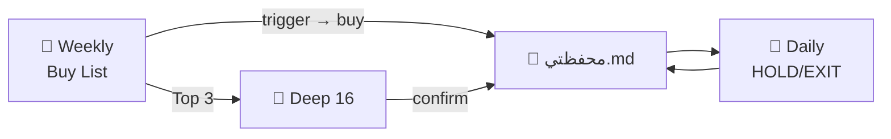

# 🔄 WORKFLOW الكامل — EGX Trading System

> **المرجع الوحيد** — Daily · Weekly · Deep · المحفظة · الملفات · الرسائل  
> 📋 المحفظة: [`محفظتي.md`](محفظتي.md)  
> ⚠️ تحليل تعليمي — مش نصيحة استثمارية

---

## 0️⃣ القاعدة الذهبية

```
📅 Weekly  = تجهيز — إيه نشتري الأسبوع ده؟
📆 Daily   = متابعة — إزاي نتعامل النهارده؟
🔬 Deep    = تحليل 16 مرحلة — لما الحدث يستاهل
💼 Portfolio = محفظتي.md — مصدر الحقيقة دائماً
```

**ممنوع في أي workflow:**
- "اشتري/بيع دلوقتي" بدون **Trigger** (مستوى/حدث)
- Market order على microcap كبير (زي 128K EAC)
- شراء من Weekly **قبل** ما trigger يتنفّذ
- Daily يبحث في 200 سهم — ده شغل Weekly

---

## 1️⃣ نظام الـ 4 طبقات

| # | الطبقة | متى | السؤال | المدخلات | المخرج |
|---|---|---|---|---|---|
| **L1** | 📅 **Weekly** | خميس | نشتري إيه؟ | 200×5 TF | Buy List Top 15 |
| **L2** | 📆 **Daily** | أحد→خميس | نتعامل إزاي؟ | close+vol محفظتك | Action + PnL |
| **L3** | 🔬 **Deep** | عند الحاجة | تحليل شامل؟ | صور/CSV سهم واحد | 16 مرحلة |
| **L4** | 💼 **Portfolio** | دائم | مراكزي إيه؟ | تحديثاتك | `محفظتي.md` |



---

## 2️⃣ هيكل المشروع (ملفات)

```
stoks-analysis/
├── README.md                          ← بوابة المشروع
├── _مشترك/
│   ├── WORKFLOW-daily-weekly.md       ← ⭐ ده — Workflow كامل
│   ├── محفظتي.md                    ← 💼 مراكزك + مستويات
│   ├── بروتوكول-المتابعة-اليومية.md
│   ├── بروتوكول-الفحص-الأسبوعي-الخميس.md
│   ├── استاندرد-الرؤية-الشاملة-لأي-سهم.md  ← Deep
│   ├── دليل-التحليلات-المدفوعة-الاحترافية.md
│   └── weekly_scan.py               ← فحص CSV آلي
├── متابعة-يومية/
│   └── YYYY-MM-DD/
│       └── brief-YYYY-MM-DD.md
├── فحص-YYYY-MM-DD/                  ← Weekly
│   ├── symbols.txt
│   ├── data/*.csv
│   └── نتيجة-الفحص-الأسبوعي.md
└── YYYY-MM-DD/                      ← أرشيف تحليلات عميقة
    └── تحليل-CODE-...
```

---

## 3️⃣ التقويم الكامل (EGX)

| اليوم | الوقت | Workflow | أنت | أنا |
|---|---|---|---|---|
| **أحد** | 14:30+ | L2 Daily | close+vol | Brief + Action |
| **اثنين** | 14:30+ | L2 Daily | + أحداث | Brief + Action |
| **ثلاثاء** | 14:30+ | L2 Daily | close+vol | Brief + Action |
| **أربعاء** | 14:30+ | L2 Daily | close+vol | Brief + راجع alerts |
| **خميس** | 14:30+ | L2 **+** L1 | محفظة **+** 200×5TF | Daily **+** Buy List |
| **جمعة** | — | — | حط alerts شراء | تسليم Weekly |
| **سبت** | — | optional | راجع الأسبوع | — |

### جلسة EGX
- **10:30–14:30** — التداول
- **14:30** — close رسمي → تبعت Daily
- **خميس 14:30** — close Weekly → تبعت Weekly

---

# 📅 L1 — WEEKLY (تجهيز شراء)

## الهدف
**Buy List الأسبوع** — من 200 سهم → Top 15 + Trigger + Sizing

## متى
**كل خميس** بعد إغلاق شمعة W (مساءً أو جمعة)

## المدخلات

### الحد الأدنى
```
📅 weekly — YYYY-MM-DD
symbols.txt (200 كود)
```

### المفضل — CSV
```
فحص-YYYY-MM-DD/
├── symbols.txt
├── _market/EGX30.csv     ← optional · RS
└── data/
    ├── COMI_M.csv
    ├── COMI_W.csv
    ├── COMI_D.csv
    ├── COMI_4H.csv
    └── COMI_1H.csv       ← × 200 سهم
```

**أعمدة CSV:** `time, open, high, low, close, volume`

## الفريمات الخمسة (ثابتة)

| TF | الدور |
|---|---|
| **M** | Weinstein Stage · trend كبير |
| **W** | **قرار الأسبوع** · ADX · MA |
| **D** | VCP · Squeeze · pivot |
| **4H** | SMC · BOS · OB |
| **1H** | Trigger دقيق |

## المخرجات (إلزامي)

| # | Deliverable |
|---|---|
| 1 | **EGX Regime** — 🟢 buy / 🟡 selective / 🔴 no new longs |
| 2 | **Buy List Top 15** — Rank · Score · Tier · Setup |
| 3 | **Trigger** — `close > X` لكل سهم |
| 4 | **Stop + R:R + Size** — كام سهم · وقف فين |
| 5 | **Out List** — rejected + السبب |
| 6 | **Watchlist Alerts** — copy-paste للتطبيق |
| 7 | **Deep Top 3–5** — optional قبل الشراء |

### نموذج Buy List

| Rk | Code | Score | Tier | Setup | Trigger 🎯 | Stop | Size | R:R |
|---|---|---|---|---|---|---|---|---|
| 1 | COMI | 87 | A | VCP p3 | close > 46.20 | 44.50 | 2000 | 3.2:1 |

### Tier System

| Tier | Score | ماذا تفعل |
|---|---|---|
| **A** | ≥75 | alert @ trigger · sizing كامل |
| **B** | 60–74 | watchlist · نصف size |
| **C** | 45–59 | مراقبة · لا دخول |
| **OUT** | <45 / filter | تجنّب |

### فلاتر رفض تلقائي
- تحت MA200W · extension >25% · سيولة <500K/يوم · 3+ distribution days · dead money (ADX<15)

## بعد Weekly — دورة الشراء

```
1. استلم Buy List
2. حط alerts @ triggers (Thndr/TV/broker)
3. ⏳ انتظر trigger — مفيش شراء قبل close > X
4. trigger اتنفّذ → Limit buy (مش market)
5. ابعت: 💼 bought CODE qty @ price
6. أحدّث محفظتي.md
7. من بكرة → Daily يتابع
```

## أمر CSV آلي
```bash
.venv/bin/python _مشترك/weekly_scan.py \
  --input فحص-YYYY-MM-DD \
  --output فحص-YYYY-MM-DD/نتيجة.csv
```

📖 تفصيل: [`بروتوكول-الفحص-الأسبوعي-الخميس.md`](بروتوكول-الفحص-الأسبوعي-الخميس.md)

---

# 📆 L2 — DAILY (متابعة وتعامل)

## الهدف
**أفضل تعامل النهارده** — HOLD · ADD · REDUCE · EXIT · WAIT

## متى
**كل يوم** بعد 14:30 — **محفظتك فقط**

## المدخلات

### الحد الأدنى (30 ثانية)
```
📆 daily — YYYY-MM-DD

EAC: close=7.48 · high=7.52 · low=7.44 · vol=493000
حدث: لا
```

### أفضل
- صورة **Daily** لكل سهم في المحفظة
- أو `CODE_D.csv`

## المخرجات (إلزامي)

| # | Deliverable |
|---|---|
| 1 | **Action** — واحد واضح per stock |
| 2 | **PnL بالجنيه** — qty × (close − avg) |
| 3 | **مستويات** — vs Death · Gate · Stop · Target |
| 4 | **تنفيذ** — Limit/Market · كم · امتى |
| 5 | **EGX** — 🟢/🟡/🔴 + distribution |
| 6 | **Alerts** — updated لو كسر |

### نموذج Daily Brief

```markdown
## EAC @ 7.48 · −3.5%
🟡 **HOLD** — فوق Death 7.25 · تحت Gate 8.14
💰 PnL: −34,668 ج · Value: 961,632 ج
⚡ اليوم: NO TRADE (AGM) · Limit فقط
🛑 STOP valid @ 7.24 Limit
```

## قاموس Actions

| Action | متى | تنفيذ |
|---|---|---|
| **HOLD** | فوق stop · plan intact | راقب alerts |
| **WAIT** | مفيش setup · سوق 🔴 | متداولش |
| **ADD** | trigger weekly + vol | Limit @ level |
| **REDUCE** | target 1 hit | Limit sell ⅓ |
| **EXIT** | تحت Death / stop hit | Limit 2–3 دفعات |
| **NO TRADE** | AGM · خبر · gap | ممنوع market |

## Decision Tree — Daily

```
                    ┌─ يوم حدث (AGM/خبر)? ─→ NO TRADE
                    │
close + vol ────────┼─ تحت Death Line? ───→ EXIT plan
                    │
                    ├─ تحت stop? ─────────→ EXIT (urgent)
                    │
                    ├─ target hit? ───────→ REDUCE ⅓
                    │
                    ├─ trigger buy hit? ──→ ADD (from weekly)
                    │
                    └─ else ──────────────→ HOLD
```

## متى Daily → Deep (L3)

| المحفز | Action |
|---|---|
| كسر Gate أو Death Line | Deep + Playbook جديد |
| AGM / نتائج / خبر كبير | Deep أو Playbook |
| أسبوعين بدون تغيير | Daily brief بس |
| Weekly Top 3 قبل شراء | Deep قبل أول buy |
| أنت طلبت "تحليل شامل" | Deep 16 مرحلة |

📖 تفصيل: [`بروتوكول-المتابعة-اليومية.md`](بروتوكول-المتابعة-اليومية.md)

---

# 🔬 L3 — DEEP (16 مرحلة)

## الهدف
**رؤية 100%** — سهم واحد · 100 أداة · 15 محترف · SMC · مدفوعة

## متى
- قبل شراء Tier A (optional لكن recommended)
- كسر مستويات حرجة
- أحداث مؤسسية
- طلبك صريح

## المدخلات
- اسم السهم + **مركزك** (qty × avg)
- صور **كل الفريمات** (M→1m) أو CSV
- Order book لو متاح

## المخرجات
| ملف | محتوى |
|---|---|
| `تحليل-CODE-رؤية-شاملة-DATE.md` | 16 مرحلة |
| `CODE-Playbook-DATE.md` | قرار حدث |
| `CODE-تنبيهات-جاهزة-DATE.md` | alerts |
| `CODE-Scorecard-DATE.md` | توقعات vs واقع |
| `*.png` | رسوم |

📖 [`استاندرد-الرؤية-الشاملة-لأي-سهم.md`](استاندرد-الرؤية-الشاملة-لأي-سهم.md) · [`دليل-التحليلات-المدفوعة-الاحترافية.md`](دليل-التحليلات-المدفوعة-الاحترافية.md)

---

# 💼 L4 — PORTFOLIO (محفظتي.md)

## مصدر الحقيقة
**كل workflow يقرأ ويكتب هنا:**

| البيان | مثال |
|---|---|
| المراكز | EAC 128,400 @ 7.75 |
| المستويات | Death 7.25 · Gate 8.14 |
| Stops | Limit 7.24 |
| الأجenda | AGM 6 Jul |
| Watchlist | COMI trigger 46.20 |

## تحديث المحفظة
```
💼 update portfolio
+ SWDY: 5000 @ 42.30 · stop 41.00
- EAC: sold 20000 @ 7.50
levels EAC: death 7.25 → 7.20
```

---

# 🔗 التكامل — أسبوع كامل (مثال)

| اليوم | أنت | أنا | ملف |
|---|---|---|---|
| **خميس 10** | daily EAC + weekly CSV | Daily brief + Buy List | `فحص-2026-07-10/` |
| **جمعة 11** | حط alerts COMI 46.20 | — | — |
| **أحد 13** | daily | EAC HOLD | `متابعة-يومية/2026-07-13/` |
| **اثنين 14** | daily | EAC HOLD | brief |
| **ثلاثاء 15** | daily | COMI trigger قرب | brief + alert |
| **أربعاء 16** | daily | COMI **trigger hit** → ADD? | brief |
| **أربعاء** | `bought COMI 2000 @ 46.25` | update محفظتي | محفظتي.md |
| **خميس 17** | daily + weekly جديد | COMI daily + Buy List جديد | cycle repeats |

---

# 📨 رسائل Copy-Paste (كل السيناريوهات)

### Daily
```
📆 daily — YYYY-MM-DD
EAC: close= · high= · low= · vol=
حدث: لا
```

### Weekly
```
📅 weekly — YYYY-MM-DD
200 سهم · M/W/D/4H/1H · CSV in فحص-YYYY-MM-DD/
فلتر: [VCP/breakout/الكل] · deep Top 5: [نعم/لا]
```

### شراء
```
💼 bought SWDY 5000 @ 42.30
stop: 41.00 · target: 45.00
```

### بيع
```
💼 sold EAC 20000 @ 7.50
reason: target 1 / stop / manual
```

### Deep
```
🔬 deep — EAC
128400 @ 7.75 · close today 7.48
مرفق: صور D/W/4H أو CSV
```

### تحديث محفظة
```
💼 update portfolio
[list changes]
```

---

# ✅ Checklists

## Daily (كل يوم)
- [ ] close + vol لكل سهم في المحفظة
- [ ] Action واحد per stock
- [ ] PnL بالجنيه
- [ ] vs Death/Gate/Stop
- [ ] EGX regime سطر
- [ ] حدث اليوم؟
- [ ] alerts updated?

## Weekly (كل خميس)
- [ ] symbols.txt 200
- [ ] 5 TF CSV (أو صور منظمة)
- [ ] EGX30 optional
- [ ] فلتر setup محدد؟
- [ ] deep Top 5؟

## بعد Weekly (جمعة)
- [ ] Buy List received
- [ ] alerts @ triggers in app
- [ ] Tier A only if EGX 🟢/🟡
- [ ] **مفيش شراء** قبل trigger

## بعد شراء
- [ ] update `محفظتي.md`
- [ ] stops placed (Limit)
- [ ] daily starts next session

## Deep (when triggered)
- [ ] مركزك بالأرقام
- [ ] كل الفريمات
- [ ] Playbook + alerts + scorecard

---

# 🛡️ قواعد EGX (ثابتة)

| Rule | Detail |
|---|---|
| **Trigger only** | مفيش buy/sell بدون level |
| **Microcap** | Limit only · ممنوع market على حجم كبير |
| **T+2** | settlement · plan liquidity |
| **حدود سعرية** | ممكن lock · NO TRADE يوم حدث |
| **Distribution** | 5 DD in 25 sessions → 🔴 no new longs |
| **Session** | قرارات كبيرة أول/آخر ساعة (Raschke) |
| **7–8% stop** | Minervini universal |
| **Confluence ≥3** | marginal = skip |

---

# 📚 خريطة المراجع

| الملف | Layer |
|---|---|
| **WORKFLOW-daily-weekly.md** | **الكل — ابدأ هنا** |
| [`templates/`](templates/README.md) | **⭐ قوالب ديناميكية Daily + Weekly** |
| [`templates/TEMPLATE-daily-متابعة.md`](templates/TEMPLATE-daily-متابعة.md) | L2 output template |
| [`templates/TEMPLATE-weekly-فحص.md`](templates/TEMPLATE-weekly-فحص.md) | L1 output template |
| [`محفظتي.md`](محفظتي.md) | L4 Portfolio |
| [`بروتوكول-المتابعة-اليومية.md`](بروتوكول-المتابعة-اليومية.md) | L2 تفصيل |
| [`بروتوكول-الفحص-الأسبوعي-الخميس.md`](بروتوكول-الفحص-الأسبوعي-الخميس.md) | L1 تفصيل |
| [`استاندرد-الرؤية-الشاملة-لأي-سهم.md`](استاندرد-الرؤية-الشاملة-لأي-سهم.md) | L3 Deep |
| [`دليل-التحليلات-المدفوعة-الاحترافية.md`](دليل-التحليلات-المدفوعة-الاحترافية.md) | 150+ أداة |
| [`weekly_scan.py`](weekly_scan.py) | L1 automation |

---

---

## Templates (ديناميك — مش تاريخ ثابت)

| Input (أنت) | Output (أنا) |
|---|---|
| [`TEMPLATE-input-daily.md`](templates/TEMPLATE-input-daily.md) | [`TEMPLATE-daily-متابعة.md`](templates/TEMPLATE-daily-متابعة.md) |
| [`TEMPLATE-input-weekly.md`](templates/TEMPLATE-input-weekly.md) | [`TEMPLATE-weekly-فحص.md`](templates/TEMPLATE-weekly-فحص.md) |

📁 [`templates/README.md`](templates/README.md)

---

# 🚀 Quick Start — أول أسبوع

| Step | Action |
|---|---|
| 1 | تأكد [`محفظتي.md`](محفظتي.md) فيها مراكزك |
| 2 | **Daily:** ابعت close EAC كل يوم |
| 3 | **خميس:** جهّز `فحص-DATE/` + 200 CSV |
| 4 | استلم Buy List · حط alerts |
| 5 | trigger → buy → update portfolio |
| 6 | Daily continues forever |

---

*📅 Workflow v3 COMPLETE · 5 يوليو 2026 · L1 Weekly · L2 Daily · L3 Deep · L4 Portfolio*
